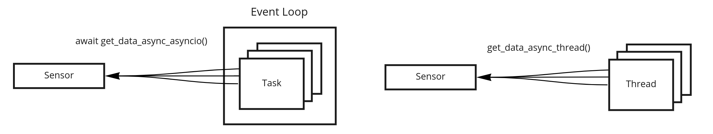

# SensorAsync

Simple sensor library for asynchronous reading using threaded or asyncio workflow. If sensors are required in asynchronous workflows, such as web servers, and multiple clients request the same resource, the same data should be automatically returned to all of them on demand and ensure that the resource is read only once.

## Overview



## Setup

* Editable install for custom sensors to be added

```shell
pip3 install -e .
```

## Examples

* Webcam benchmark reading data from multiple concurrent threads.

```shell
cd examples
python3 benchmark_threads.py
```

* Webcam benchmark reading data from multiple concurrent asyncio tasks.

```shell
cd examples
python3 benchmark_asyncio.py
```

* Configure sensors in `config.yaml` file and automatically store all measurements as files.

```shell
cd examples
python3 dump_sensors.py
```
